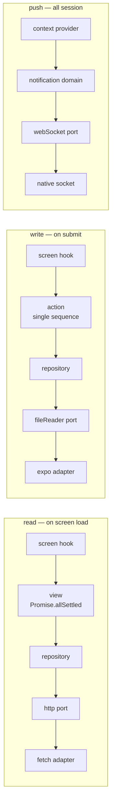
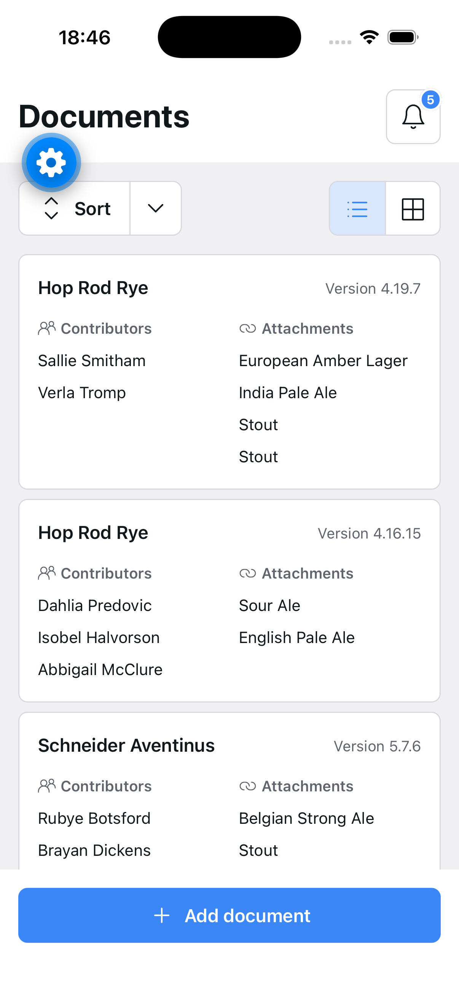
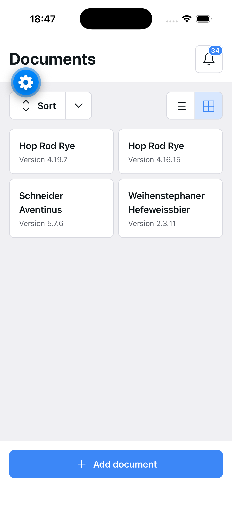
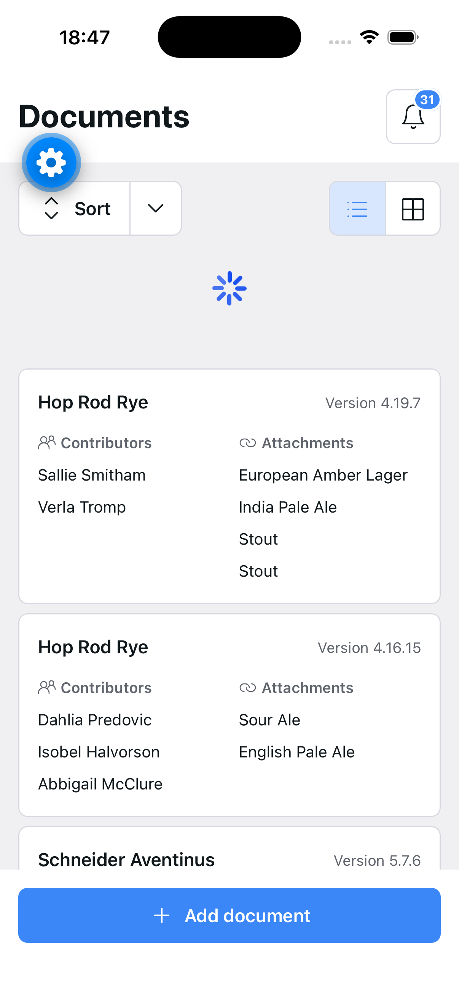
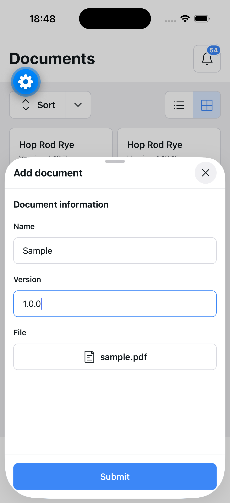
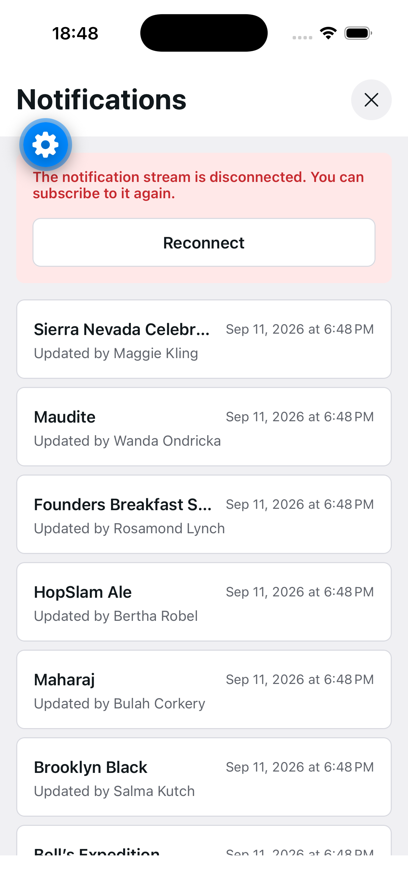
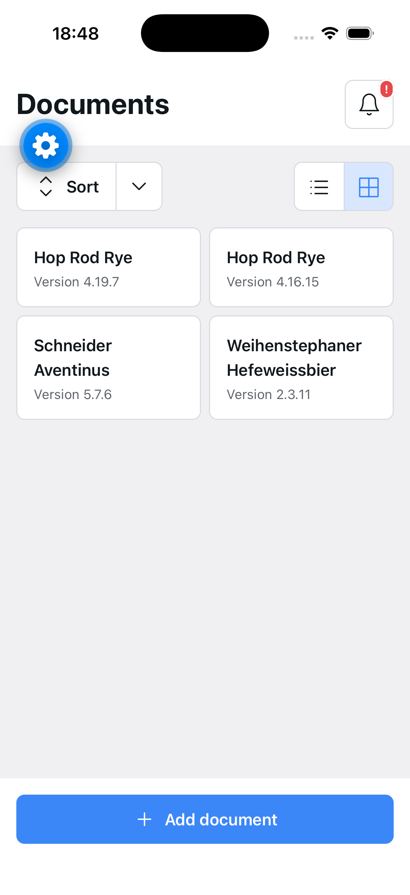
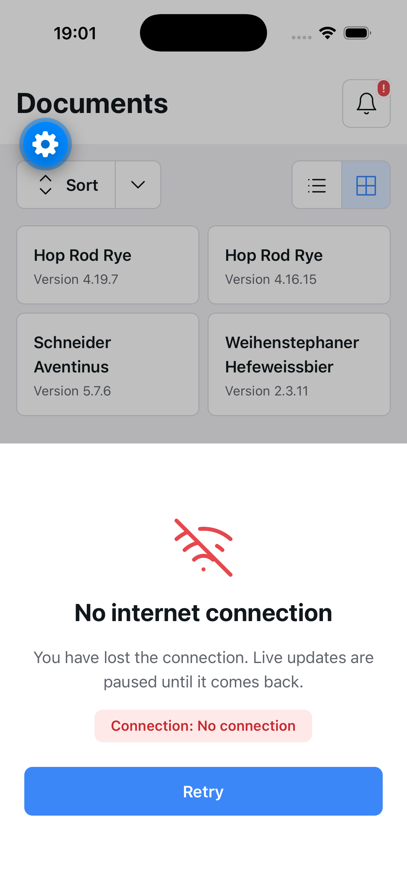

# App flow

What the app does, screen by screen, and what runs underneath each one.

The [development diary](./DEVELOPMENT_DIARY_EN.md) explains *why* each piece is
shaped the way it is; this document is the *what happens when*. Setup and how to
run it live in the [README](./README.md).

> Spanish version: [APP_FLOW_ES.md](./APP_FLOW_ES.md)

## The three routes

| Route | File | Screen | Presentation |
|---|---|---|---|
| `/` | `src/app/index.tsx` | `DocumentListScreen` | full screen |
| `/new` | `src/app/new.tsx` | `DocumentNewScreen` | native `formSheet`, detent `0.75` |
| `/notifications` | `src/app/notifications.tsx` | `NotificationListScreen` | full screen |

`src/app/_layout.tsx` mounts all three inside `AppContextProvider` — which opens
the notification stream for the whole session — and hangs `NetworkStatusGate`
beside the `<Stack>`, outside any route.

## The layers a request crosses

Reads and writes travel different paths, and neither lets a library reach the UI:



A **view** fans out and returns per-section state, so one failed call degrades one
section. An **action** is one sequence and returns a single `ok` / `error`. Both
live under `src/core/`.

---

## 1. Launch — the document list



`useDocumentListScreen` mounts and starts three things at once:

1. **The documents.** An `AbortController` is created and stored in a ref, then
   `loadDocumentListState` → `loadDocumentListView(signal)` →
   `getDocumentList(signal)` → `httpService.get('/documents')`. The payload is
   translated by `documentListPayloadToModel` before it leaves the domain, so no
   backend field naming reaches a component. Unmounting aborts the request.
2. **The stored layout.** `restoreDocumentListLayout` reads
   `documentList.layout` from the storage port. It answers asynchronously, so the
   first frame always paints `list` and swaps if a stored value lands.
3. **The notification count.** `useNotifications()` reads the context that the
   provider already subscribed at app start — the screen never opens a socket.

The template gets one discriminated `DocumentListStateModel`
(`loading` | `error` | `content`) and swaps only the block between the toolbar
and the footer. The header, the toolbar and **Add document** are identical in
every state. An empty list is `content` with no documents, not a fourth state.

## 2. List ⇄ grid, and sorting



**Layout** is owned by the screen so it can outlive the process.
`handleLayoutChange` sets state *and* writes to the storage port; a failed read
or write is logged and swallowed, because a device that cannot keep a preference
should still open the page. The stored string is validated by
`isDocumentListLayout` before it is trusted.

One component paints both: `List` takes a `columns` number — one is a list, two
is a grid — and is the only file in the app that touches `FlatList`, so
virtualisation is on everywhere by default.

**Sort** works the other way round: it is applied inside `DocumentListBody` with
`localeCompare` on the single path that hands documents to the list, and it is
deliberately *not* stored, so it resets on launch. The two criteria are
`nameAsc` and `nameDesc` — there is no date in `DocumentListItemModel` to sort
by.

## 3. Pull to refresh



The gesture belongs to `List`, the only component that scrolls, which hands a
real `RefreshControl` to `FlatList`.

`isRefreshing` travels **beside** `state`, never inside it: reusing `Loading`
would swap the rows for a spinner and hide the very list the user is pulling on.
`handleRefresh` reuses the `AbortController` the mount effect already owns, so a
refresh fired just before navigating away is cancelled with everything else. The
reloaded result goes through the same `toDocumentListState`, so a failed refresh
replaces the rows with the controlled error message exactly as a first load
would.

## 4. Creating a document



**Add document** navigates to `/new`, which expo-router presents as a native
`formSheet` at 75% height. The screen renders its content and nothing else —
dismissal is the platform's.

The split is by who can answer the question:

- **The template owns the fields.** Values, `isSubmitting` and whether Submit is
  pressable stay in `useNewDocumentFormTemplate`, so a keystroke does not
  re-render the screen.
- **`onSubmit` owns the outcome.** It answers with a
  `NewDocumentFormResponseModel` — success, or an error carrying its own
  message — and the template only paints it.

On submit, `createDocumentAction` runs three steps in order:

```
readAsBase64(fileUri)   →   createDocument({name, version, fileName, fileBase64})   →   ok
    fileReader port              document repository                                     ↓
                                                                            screen calls goBack()
```

An error at any step comes back as one translated message; the fields stay
exactly as typed so a retry costs nothing, and they lock rather than being
swapped for a spinner, so what is being created stays readable while in flight.

> **The create endpoint does not exist yet.** `createDocument` maps the payload
> the API will take and then awaits a 2000 ms stand-in — the real `httpService.post`
> call sits directly beneath it, commented, taking the same `payload` variable.
> Everything above the domain is written against the final signature, and the
> delay is what makes the disabled fields and the `Submitting…` label visible.

## 5. Notifications



The stream is **not** opened by this screen. `NotificationContextProvider` is an
entry in `APP_CONTEXT_PROVIDERS`, so it subscribes once when the app mounts and
closes on unmount. `subscribeToNotifications` hands back a subscription carrying
only `close` — never the raw socket's `send` — and every payload is mapped out
of the server's PascalCase before it leaves the domain.

Screens reach it through `useNotifications()`, never through `useContext`
directly. The context accumulates the notifications themselves, not just the
count: the socket is the only source and no repository can be asked for them
again.

Opening this page calls `markAsRead` once on mount, which resets `count` to zero
while keeping the list. That turns the badge into "unread since you last looked"
and leaves the page as the complete record.

The reconnection itself lives in the WebSocket port, which reopens on an
unexpected close with a delay that doubles. Consumers only ever see a status
change.

## 6. When the stream dies



After **three consecutive failures** the stream controller closes the
subscription and flips `isError`. A delivered notification resets the counter, so
an isolated blip never trips it.

That surfaces in two places, and neither of them throws anything away:

- **On the badge**, above — red fill, `!` in place of the number, visible at
  zero. The count is ignored rather than cleared, so the pill returns to its
  number the moment the error lifts. A stale number carries no sign that it is
  stale, which is worse than no number at all.
- **Above the feed** (screenshot in §5) — a banner with a **Reconnect** button
  calling `startSubscription`, which clears the error and opens a fresh socket.
  The notifications already received stay painted underneath, because a
  reconnect does not replay them and nothing else stores them.

## 7. Losing the network



`NetworkStatusGate` is mounted once beside `<Stack>` and paints nothing while the
device is online. Offline it fills the screen with a sheet that has no dismiss
target, so **Retry** is the only way out — navigating away would throw away the
route the user wants back.

On iOS the notice is raised to window level through `WindowOverlay`
(`FullWindowOverlay`), because an overlay in the React tree is still a child of
the root view and the `/new` form sheet is not: without it, losing the network
with the form open would leave the notice rendered *underneath* it.

Going offline also cuts the stream. The subscription effect keys on `isOnline`
and calls `fail` rather than `stop`, taking the exact path three stream errors
already take — the socket closes, its reconnect timers go with it, and the feed
reports itself unavailable instead of looking healthy but frozen. A socket
retrying into a dead network is a battery drain with a log line.

**Retry** asks the network port for a fresh reading and, only once it comes back
online, `router.replace`s the current pathname. Replace always mounts a new route
key, so the screen re-runs its loaders where the user already was.

---

## Where each piece lives

| Concern | Path |
|---|---|
| Routes | `src/app/` |
| Screens (wiring only) | `src/screens/<name>Screen/` |
| Read orchestration | `src/core/views/<entity><purpose>View/` |
| Write orchestration | `src/core/actions/<operation>Action/` |
| Entities, repositories, mappers | `src/core/domains/<entity>/` |
| Library boundaries | `src/services/<capability>/` |
| Design system | `src/ui/{atoms,molecules,organisms,templates}/` |
| App-wide state | `src/context/` |

Every component in `src/ui/` is documented and playable in Storybook —
`yarn storybook`. The page templates can be driven into their loading, error and
content states there without a backend.
