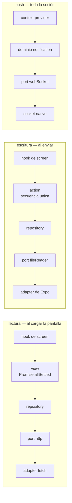

# Flujo de la app

Qué hace la app, pantalla a pantalla, y qué se ejecuta por debajo de cada una.

El [diario de desarrollo](./DEVELOPMENT_DIARY_ES.md) explica *por qué* cada pieza
tiene la forma que tiene; este documento es el *qué ocurre cuándo*. La
instalación y cómo arrancarlo están en el [README](./README.md).

> Versión en inglés: [APP_FLOW.md](./APP_FLOW.md)

## Las tres rutas

| Ruta | Fichero | Screen | Presentación |
|---|---|---|---|
| `/` | `src/app/index.tsx` | `DocumentListScreen` | pantalla completa |
| `/new` | `src/app/new.tsx` | `DocumentNewScreen` | `formSheet` nativo, detent `0.75` |
| `/notifications` | `src/app/notifications.tsx` | `NotificationListScreen` | pantalla completa |

`src/app/_layout.tsx` monta las tres dentro de `AppContextProvider` —que abre el
stream de notificaciones para toda la sesión— y cuelga `NetworkStatusGate` al
lado del `<Stack>`, fuera de cualquier ruta.

## Las capas que atraviesa una petición

Las lecturas y las escrituras recorren caminos distintos, y ninguno deja que una
librería llegue a la UI:



Una **view** abre en abanico y devuelve estado por sección, así que una llamada
fallida degrada una sección. Una **action** es una sola secuencia y devuelve un
único `ok` / `error`. Ambas viven bajo `src/core/`.

---

## 1. Arranque — la lista de documentos


`useDocumentListScreen` se monta y arranca tres cosas a la vez:

1. **Los documentos.** Se crea un `AbortController`, se guarda en una ref y
   arranca `loadDocumentListState` → `loadDocumentListView(signal)` →
   `getDocumentList(signal)` → `httpService.get('/documents')`. El payload lo
   traduce `documentListPayloadToModel` antes de salir del dominio, así que la
   forma de los campos del backend no llega a ningún componente. Desmontar
   aborta la petición.
2. **El layout guardado.** `restoreDocumentListLayout` lee `documentList.layout`
   del port de storage. Responde de forma asíncrona, así que el primer frame
   siempre pinta `list` y cambia si llega un valor almacenado.
3. **El contador de notificaciones.** `useNotifications()` lee el context al que
   el provider ya se suscribió al arrancar la app — la pantalla no abre ningún
   socket.

La template recibe un único `DocumentListStateModel` discriminado
(`loading` | `error` | `content`) y cambia solo el bloque entre la toolbar y el
footer. La cabecera, la toolbar y **Add document** son idénticos en todos los
estados. Una lista vacía es `content` sin documentos, no un cuarto estado.

## 2. Lista ⇄ grid, y el orden


El **layout** es de la screen para que sobreviva al proceso.
`handleLayoutChange` guarda el estado *y* escribe en el port de storage; un
fallo de lectura o de escritura se registra y se traga, porque un dispositivo
que no puede conservar una preferencia debería poder abrir la página igual. El
string almacenado pasa por `isDocumentListLayout` antes de darlo por bueno.

Un solo componente pinta ambas vistas: `List` recibe un número en `columns`
—una es lista, dos es grid— y es el único fichero de la app que toca `FlatList`,
así que la virtualización está activa en todas partes por defecto.

El **orden** funciona al revés: se aplica dentro de `DocumentListBody` con
`localeCompare`, en el único camino que entrega los documentos a la lista, y
deliberadamente *no* se guarda, así que se reinicia en cada arranque. Los dos
criterios son `nameAsc` y `nameDesc` — no hay ninguna fecha en
`DocumentListItemModel` por la que ordenar.

## 3. Pull to refresh


El gesto pertenece a `List`, el único componente que hace scroll, que entrega un
`RefreshControl` real a `FlatList`.

`isRefreshing` viaja **al lado** de `state`, nunca dentro: reutilizar `Loading`
cambiaría las filas por un spinner y escondería justo la lista de la que el
usuario está tirando. `handleRefresh` reutiliza el `AbortController` que el
efecto de montaje ya tiene, así que un refresco lanzado justo antes de salir de
la pantalla se cancela con todo lo demás. El resultado recargado pasa por el
mismo `toDocumentListState`, así que un refresco que falla sustituye las filas
por el mensaje de error controlado exactamente igual que haría una primera
carga.

## 4. Crear un documento


**Add document** navega a `/new`, que expo-router presenta como un `formSheet`
nativo al 75% de altura. La screen renderiza su contenido y nada más — el cierre
lo hace la plataforma.

El reparto sigue a quién puede responder la pregunta:

- **La template es dueña de los campos.** Los valores, `isSubmitting` y si
  Submit se puede pulsar viven en `useNewDocumentFormTemplate`, así que una
  pulsación de tecla no re-renderiza la screen.
- **`onSubmit` es dueño del resultado.** Responde con un
  `NewDocumentFormResponseModel` —éxito, o error con su propio mensaje— y la
  template solo lo pinta.

Al enviar, `createDocumentAction` ejecuta tres pasos en orden:

```
readAsBase64(fileUri)   →   createDocument({name, version, fileName, fileBase64})   →   ok
    port fileReader              repository de document                                  ↓
                                                                          la screen llama a goBack()
```

Un error en cualquier paso vuelve como un único mensaje traducido; los campos se
quedan tal cual se escribieron para que reintentar no cueste nada, y se bloquean
en vez de cambiarse por un spinner, así que lo que se está creando sigue siendo
legible mientras va en vuelo.

> **El endpoint de creación todavía no existe.** `createDocument` mapea el
> payload que la API va a recibir y después espera un simulacro de 2000 ms — la
> llamada real a `httpService.post` está justo debajo, comentada, tomando la
> misma variable `payload`. Todo lo que hay por encima del dominio está escrito
> contra la firma definitiva, y el retardo es lo que hace visibles los campos
> bloqueados y la etiqueta `Submitting…`.

## 5. Notificaciones


El stream **no** lo abre esta pantalla. `NotificationContextProvider` es una
entrada de `APP_CONTEXT_PROVIDERS`, así que se suscribe una vez cuando la app se
monta y cierra al desmontar. `subscribeToNotifications` devuelve una suscripción
que lleva solo `close` —nunca el `send` del socket— y cada payload se mapea
desde el PascalCase del servidor antes de salir del dominio.

Las pantallas llegan a él por `useNotifications()`, nunca por `useContext`
directamente. El context acumula las notificaciones en sí, no solo el contador:
el socket es la única fuente y no hay repository al que volver a pedirlas.

Abrir esta página llama a `markAsRead` una vez al montar, que pone `count` a cero
conservando la lista. Eso convierte el badge en "sin leer desde la última vez que
miraste" y deja la página como el registro completo.

La reconexión vive en el port de WebSocket, que reabre ante un cierre inesperado
con un retardo que se duplica. Los consumidores solo ven un cambio de estado.

## 6. Cuando el stream muere


Tras **tres fallos consecutivos**, el controller del stream cierra la suscripción
y levanta `isError`. Una notificación entregada reinicia el contador, así que un
fallo aislado nunca lo dispara.

Eso sale a la superficie en dos sitios, y ninguno tira nada a la basura:

- **En el badge**, arriba — relleno rojo, `!` en lugar del número, y visible
  incluso a cero. El contador se ignora en vez de borrarse, así que la píldora
  vuelve a su número en cuanto el error se levanta. Un número caduco no lleva
  ninguna señal de estar caduco, y eso es peor que no tener número.
- **Sobre el feed** (captura en §5) — un banner con un botón **Reconnect** que
  llama a `startSubscription`, que limpia el error y abre un socket nuevo. Las
  notificaciones ya recibidas siguen pintadas debajo, porque una reconexión no
  las reproduce y nada más las guarda.

## 7. Perder la red


`NetworkStatusGate` se monta una vez al lado del `<Stack>` y no pinta nada
mientras el dispositivo tiene red. Sin conexión llena la pantalla con un sheet
que no tiene zona de cierre, así que **Retry** es la única salida — navegar a
otro sitio tiraría justo la ruta que el usuario quiere recuperar.

En iOS el aviso se sube a nivel de ventana con `WindowOverlay`
(`FullWindowOverlay`), porque un overlay dentro del árbol de React sigue siendo
hijo de la root view y el form sheet de `/new` no lo es: sin eso, perder la red
con el formulario abierto dejaría el aviso pintado *por debajo* de él.

Quedarse sin red también corta el stream. El efecto de la suscripción se engancha
a `isOnline` y llama a `fail` en vez de a `stop`, tomando exactamente el camino
que ya toman tres errores del stream — el socket se cierra, sus timers de
reconexión se van con él, y el feed se declara no disponible en lugar de
aparentar salud estando congelado. Un socket reintentando contra una red muerta
es gastar batería con una línea de log.

**Retry** le pide al port de red una lectura nueva y, solo cuando vuelve a estar
online, hace `router.replace` del pathname actual. Replace siempre monta una key
de ruta nueva, así que la pantalla vuelve a ejecutar sus cargas donde el usuario
ya estaba.

---

## Dónde vive cada pieza

| Responsabilidad | Ruta |
|---|---|
| Rutas | `src/app/` |
| Screens (solo cableado) | `src/screens/<name>Screen/` |
| Orquestación de lectura | `src/core/views/<entity><purpose>View/` |
| Orquestación de escritura | `src/core/actions/<operation>Action/` |
| Entidades, repositories, mappers | `src/core/domains/<entity>/` |
| Fronteras con librerías | `src/services/<capability>/` |
| Design system | `src/ui/{atoms,molecules,organisms,templates}/` |
| Estado global | `src/context/` |

Todos los componentes de `src/ui/` están documentados y se pueden manipular en
Storybook — `yarn storybook`. Las templates de página se pueden llevar allí a sus
estados de carga, error y contenido sin backend ninguno.
